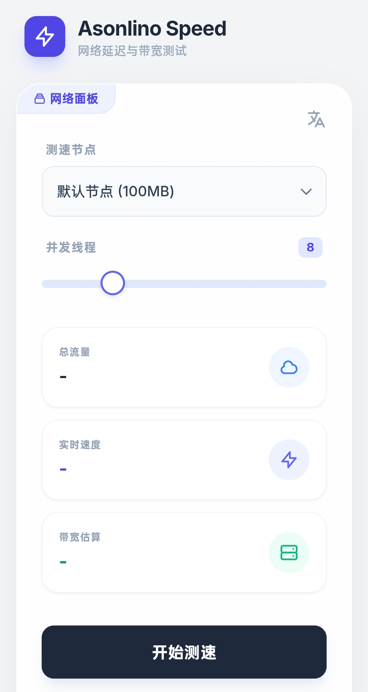

# 🚀 Asonlino Speed

**Asonlino Speed** 是一款运行在 Cloudflare Workers 上的轻量级网络测速工具。它无需服务器、无需占用存储空间，利用边缘网络优势，提供精准的下行速度测试。

拥有极简的现代化 UI 设计，支持多语言切换，是测试本地网络与 Cloudflare 边缘节点连接质量的绝佳工具。

> [!TIP]
> **无需后端服务器，无需 R2 存储，完全免费的边缘测速方案。**

## ✨ 特性 (Features)

* **⚡️ 边缘测速**：依托 Cloudflare 全球庞大的 CDN 网络，测试真实的链路速度。
* **💸 零成本部署**：后端逻辑完全基于 Cloudflare Workers，文件流实时生成（0 占用存储）。
* **🎨 现代 UI**：融合了 DataBurn 与 FlowLoss 的设计风格，采用毛玻璃（Glassmorphism）与清新配色。
* **🌍 多语言支持**：内置 **中文 / English / 日本语**，一键无缝切换。
* **🛠 高度可配置**：支持自定义并发线程数、自定义下载文件大小（0-1024MB）。
* **📊 实时数据**：实时展示已下载流量、当前速度及预估带宽。

## 📸 截图 (Screenshot)

*(请在此处替换为你实际的运行截图)*

## 🚀 快速部署 (Quick Start)

只需要一个文件即可部署！

1.  登录 **[Cloudflare Dashboard](https://dash.cloudflare.com/)**。
2.  进入 **Workers & Pages** -> **Create Application** -> **Create Worker**。
3.  命名你的 Worker（例如 `speedtest`），点击 **Deploy**。
4.  点击 **Edit code**。
5.  将本仓库中的 `worker.js` 内容完全复制并覆盖在线编辑器中的代码。
6.  点击 **Save and Deploy**。
7.  访问你的 Worker 域名（例如 `https://speedtest.your-name.workers.dev/speed`）即可使用！

## 📖 API 使用 (API Usage)

除了 Web 界面，你也可以直接调用 API 进行测速或集成到其他工具中。

### 1. Web 界面
访问路径：`/speed`
> 示例：`https://your-domain.workers.dev/speed`

### 2. 文件下载 (测速核心)
访问路径：`/speed/down`

| 参数 (Param) | 类型 | 范围 | 说明 |
| :--- | :--- | :--- | :--- |
| `mb` | Number | 0 - 1024 | 指定下载文件的大小 (单位: MB) |

**示例：**
* **默认 (100MB):** `https://your-domain.workers.dev/speed/down`
* **指定 50MB:** `https://your-domain.workers.dev/speed/down?mb=50`
* **指定 1GB:** `https://your-domain.workers.dev/speed/down?mb=1024`

> 注意：为了防止滥用，最大请求限制为 1024MB。如果请求超出范围，将返回 404 错误。

## ⚙️ 原理 (How it works)

不同于传统的测速网站需要存放真实的静态文件，**Asonlino Speed** 使用 `ReadableStream` 在内存中实时生成全 `0` 的二进制数据流。
这意味着：
1.  **不消耗对象存储费用**（如 AWS S3 或 Cloudflare R2）。
2.  **速度极快**：数据直接从内存推送到网络接口，无磁盘 I/O 瓶颈。

## 🤝 贡献 (Contributing)

欢迎提交 Issue 或 Pull Request 来改进 UI 或增加新功能！

## 📄 开源协议 (License)

MIT License © 2025 Asonlino
